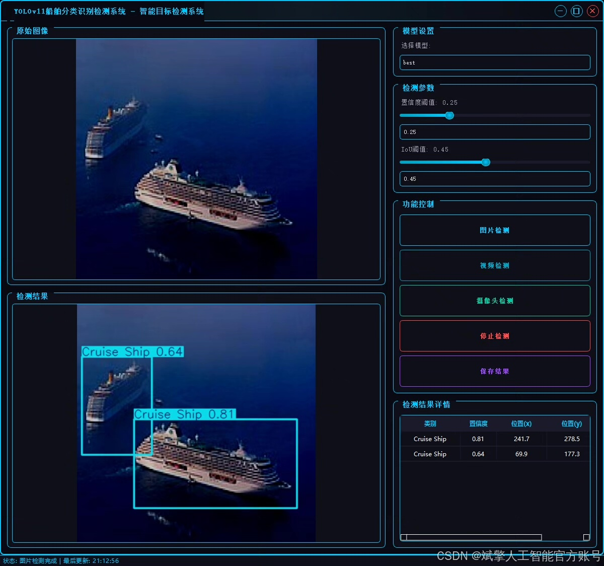
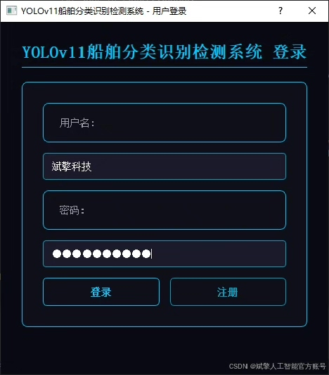
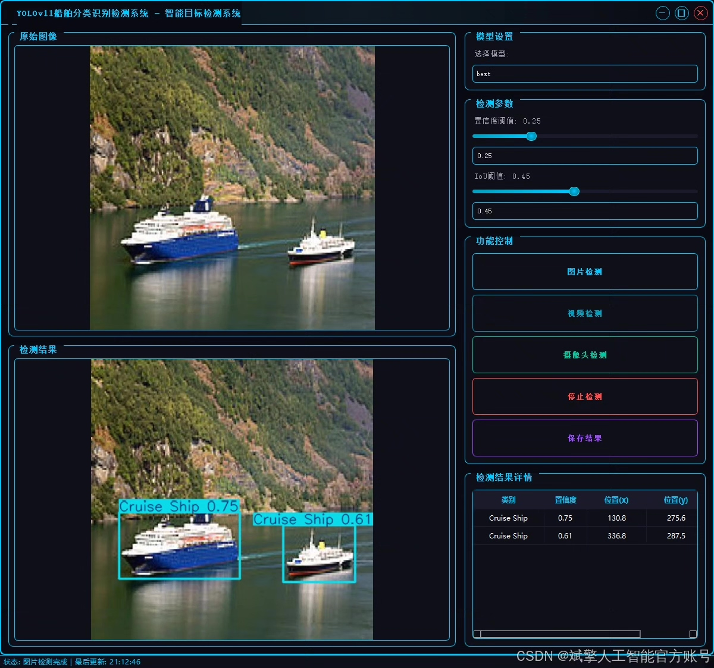
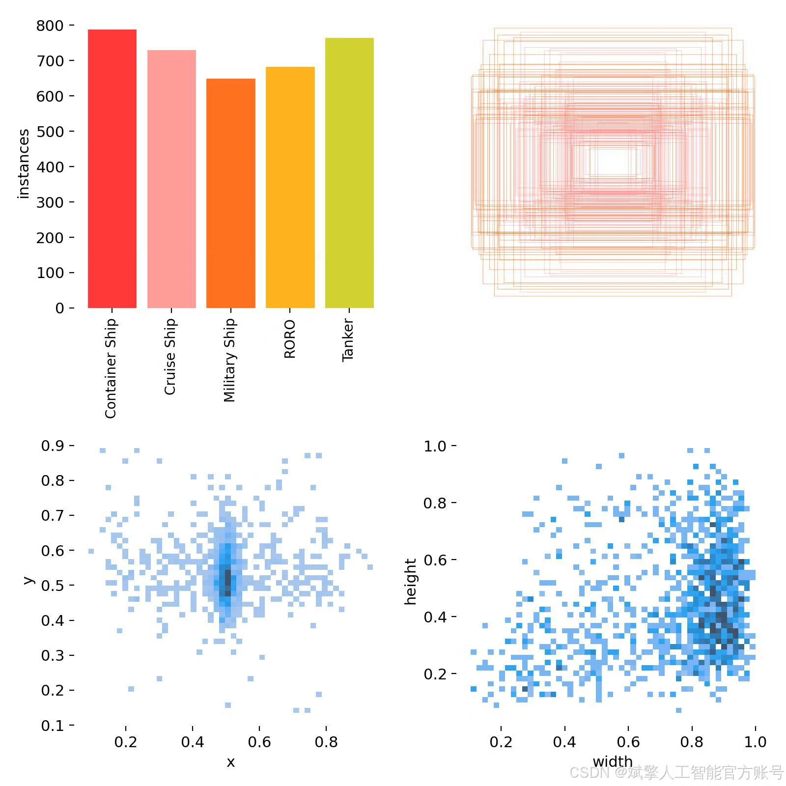
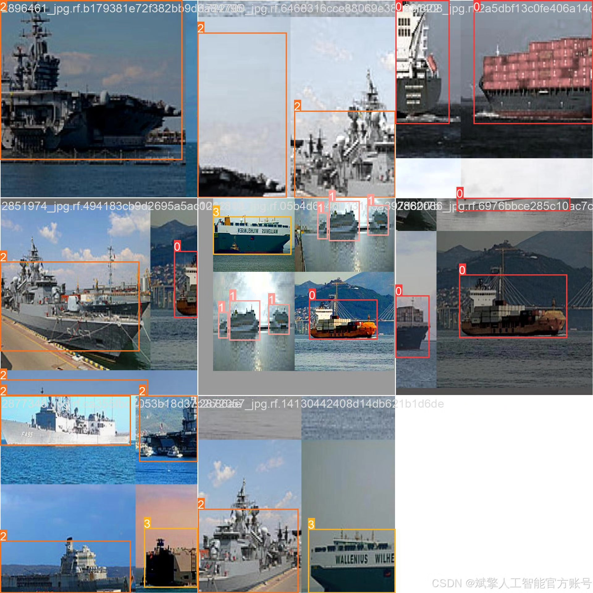
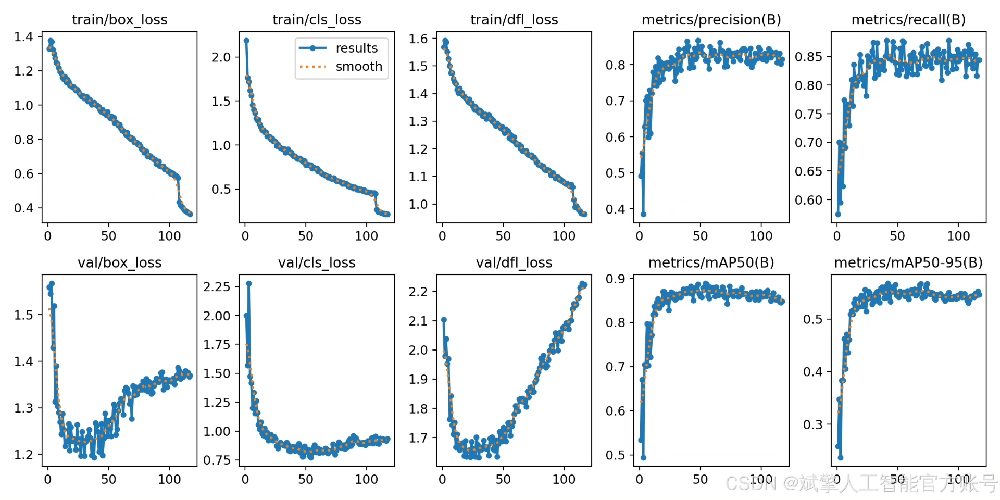
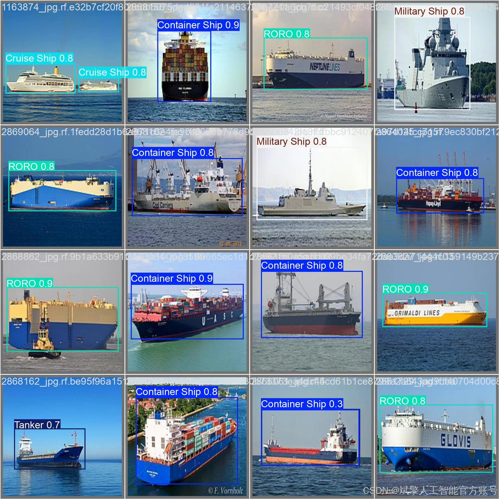

# YOLOv11 Ship Intelligent Detection System

## Body

YOLOv11 Ship Intelligent Detection System based on Deep Learning YOLOv11: A ship image classification and detection system (YOLOv11+YOLO dataset + UI interface + login registration interface + Python project source code + model)

This project is based on the advanced YOLOv11 object detection algorithm, developing a high-efficiency and precise ship image classification and detection system. This system can locate (Bounding Box) ship targets in input images or videos in real time and accurately classify them into five specific categories: Container Ship, Cruise Ship, Military Ship, Roll-on/Ro-Roll (RORO), and Tanker. As the latest iteration of the YOLO series, YOLOv11 achieves an excellent balance between detection speed and accuracy, making it very suitable for applications that require real-time performance, such as maritime monitoring, port management, shipping logistics, etc. The successful construction of this system provides powerful technical tools for automated ship recognition and analysis, significantly improving the work efficiency and level of intelligence in related fields.

Dataset:
nc: 5
names: ['Container Ship', 'Cruise Ship', 'Military Ship', 'RORO', 'Tanker'],
dataset quantity: training set 3232, validation set 339, test set 150

✅ User login registration: Support password checking and security verification.
✅ Three detection modes: Based on the YOLOv11 model, support image, video, and real-time camera three types of detection, accurately identify targets.
✅ Dual screen comparison: Display original scene and detection results on the same screen.
✅ Data visualization: Real-time table displaying the category, confidence, and coordinates of detected targets.
✅ Intelligent parameter adjustment: Provide a confidence slide bar to dynamically optimize detection accuracy, adapt to different scene needs.
✅ Sci-fi style interactive interface: Dark theme combined with dynamic light effects, reducing visual fatigue and improving operation experience.

## Images

## Payment

Here is a pay link on Stripe ( https://buy.stripe.com/3cs8yP7sY87d0vu9AB ). Please contact me lonlonago@foxmail.com after funding $89, and I will send you a complete data files , thank you!

